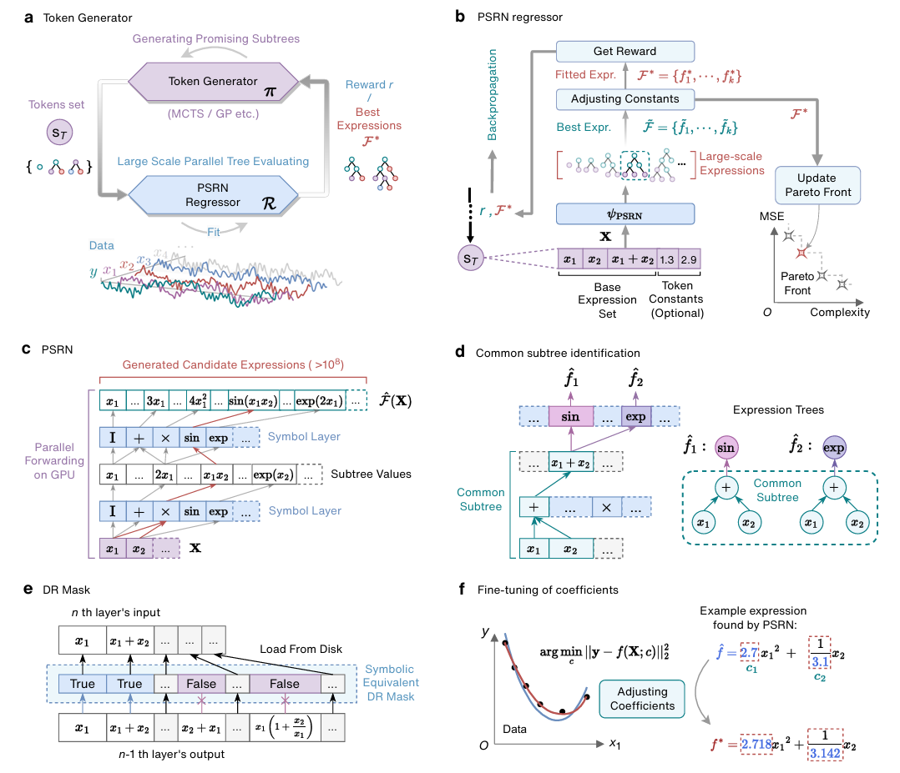
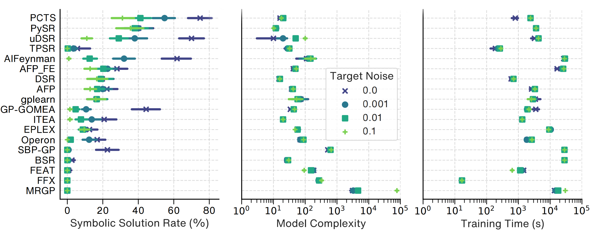

# PCTS: Parallel Combinatorial Tree Search for Symbolic Regression

*Official implementation of PCTS (formerly PTS) with its core PSRN (Parallel Symbolic Regression Network) module*





This repository contains the official PyTorch implementation of PCTS (Parallel Combinatorial Tree Search): A fast and efficient symbolic expression discovery method powered by PSRN (Parallel Symbolic Regression Network). PSRN evaluates millions of symbolic expressions simultaneously on GPU with automated subtree reuse.

## 📥 Installation

### Step 1: Create an Environment and Install PyTorch

```bash
conda create -n PSRN python=3.9 "pytorch>=2.0.0" pytorch-cuda=12.1 -c pytorch -c nvidia
```

_Note: Adjust the `pytorch-cuda` version as necessary based on your GPU's CUDA version._

### Step 2: Install Other Dependencies Using Pip

```bash
conda activate PSRN
pip install -r requirements.txt
```

### ⚠️ Important Notes

- If using a version of PyTorch below 2.0, an error may occur during the `torch.topk` operation.
- The experiments were performed on servers with Nvidia A100 (80GB) and Intel(R) Xeon(R) Platinum 8380 CPUs @ 2.30GHz.
- We recommend using a high-memory GPU as smaller cards may encounter CUDA memory errors under our experimental settings. If you experience memory issues, consider reducing the number of input slots or opting for `semi_koza` operator sets (e.g., replacing `"Sub"` and `"Div"` with `"SemiSub"` and `"SemiDiv"`) or `basic` operator sets (e.g., replacing `"Sub"` and `"Div"` with `"Neg"` and `"Inv"`).

## 🚀 Quickstart with Custom Data

To execute the script with custom data, use the following arguments:

- `-g`: Specifies the GPU to use. Enter the GPU index.
- `-i`: Sets the number of input slots for PSRN.
- `-c`: Indicates whether to include constants in the computation (True / False).
- `-l`: Defines the operator library to be used. Specify the name of the library or an operator list.
- `--csvpath`: Specifies the path to the CSV file to be used. By default, if not specified, it uses `./custom_data.csv`. Each column represents an independent variable.

For more detailed parameter settings, please refer to the `run_custom_data.py` script.

### 📝 Examples

To run the script with custom data with an expression probe (the algorithm will stop when it finds the expression or its symbolic equivalents):

```bash
python run_custom_data.py -g 0 -i 5 -c False --probe "(exp(x)-exp(-x))/2"
```

Without an expression probe:

```bash
python run_custom_data.py -g 0 -i 5 -c False
```

For limited VRAM (or when the ground truth expression is expected to be simple):

```bash
python run_custom_data.py -g 0 -i 3 -c False --probe "(exp(x)-exp(-x))/2"
```

To customize the operator library:

```bash
python run_custom_data.py -g 0 -i 5 -c False --probe "(exp(x)-exp(-x))/2" -l "['Add','Mul','Identity','Tanh','Abs']"
```
_Note: If using GP as the token generator, you may also need to change the operator that GP uses in `token_generator_config.yaml`_

For custom data paths:

```bash
python run_custom_data.py -g 0 -i 5 -c False --probe "(exp(x)-exp(-x))/2" --csvpath ./another_custom_data.csv
```

### 📋 Note on DR Mask Files

The `.npy` files under `./dr_mask` are pre-generated. When you try to use a new network architecture (e.g., a new combination of operators, number of variables, and number of layers), you may need to run the gen_dr_mask.py script first. Typically, this process takes less than a minute:

```bash
python utils/gen_dr_mask.py --n_symbol_layers=3 --n_inputs=5 --ops="['Add','Mul','SemiSub','SemiDiv','Identity','Sin','Cos','Exp','Log','Tanh','Cosh','Abs','Sign']"
```

## ⚙️ Custom Stages

If you want to customize the operators, the number of PSRN inputs, and configure custom search stages, you can edit the `.yaml` files under the `model/stages_config` directory, or pass a dictionary directly to the `stage_config=...` field when instantiating the `PSRN_Regressor`.

Example:

```yaml
default:
  operators: ['Add', 'Mul', 'SemiSub', 'SemiDiv', 'Identity', 'Sin', 'Cos', 'Exp', 'Log']
  time_limit: 900  # 60 * 15
  n_psrn_inputs: 7
  n_sample_variables: 5

stages:
  - {time_limit: 5, n_psrn_inputs: 5}
  - {}
  - {}
```

Explanation: First, set the default stage parameters in `default`. Then, design the specific search workflow in `stages`. An empty pair of curly braces `{}` indicates a stage that uses the default parameters.

## 📊 Symbolic Regression Benchmark

To reproduce our experiments, execute the following command:

```bash
python run_benchmark_all.py --n_runs 100 -g 0 -b benchmark.csv
```

For the Feynman expressions:

```bash
python run_benchmark_all.py --n_runs 100 -g 0 -b benchmark_Feynman.csv
```

The Pareto optimal expressions and corresponding statistics for each puzzle are available in the `log/benchmark` directory. Additionally, the expected runtime for each puzzle can be found in the supplementary materials.

## 🔄 Chaotic Dynamics

Discover the dynamics of chaotic systems by running:

```bash
python run_chaotic.py --n_runs 50 -g 0     # Using GPU index 0
```

This script will generate Pareto optimal expressions for each derivative, and the outcomes will be stored in the `log/chaotic` directory.

### 📈 Evaluating Symbolic Recovery

Assess the symbolic recovery rate by executing:

```bash
python result_analyze_chaotic.py
```

This analysis will automatically compute and save the statistics to `log/chaotic_symbolic_recovery/psrn_stats.csv`

## 🔬 Realworld Data - EMPS

```bash
python run_realworld_EMPS.py --n_runs 20 -g 0    # Using GPU index 0
```

The results (Pareto optimal expressions) can be found in `log/EMPS`

## 🔬 Realworld Data - Turbulent Friction

```bash
python run_realworld_roughpipe.py --n_runs 20 -g 0     # Using GPU index 0
```

The results (Pareto optimal expressions) can be found in `log/roughpipe`

## 🧪 Ablation Studies

To reproduce our ablation studies, execute the following commands.
The results will be stored in the `log/` directory.

### Token Generator Ablation

```bash
python run_benchmark_all.py --n_runs 100 -g 0 -b benchmark.csv -t MCTS
python run_benchmark_all.py --n_runs 100 -g 0 -b benchmark.csv -t GP
python run_benchmark_all.py --n_runs 100 -g 0 -b benchmark.csv -t Random
```

### Constant Range Sensitivity

```bash
python study_ablation/constants/run_c_experiments.py --n_runs 20 -g 0 -t GP
python study_ablation/constants/run_c_experiments.py --n_runs 20 -g 0 -t MCTS
```

### DR Mask Ablation

You can modify the operator library and adjust the number of input slots in yaml file, and choose whether to use the DR Mask.
While the script is running, monitor the memory footprint using nvidia-smi or nvitop.

```bash
python study_ablation/drmask/run_without_drmask.py --use_drmask True -g 0
python study_ablation/drmask/run_without_drmask.py --use_drmask False -g 0
```

## 🏆 SRbench Evaluation

To evaluate PCTS's performance on SRbench, follow these steps:

1. Copy the `SRBenchRegressor` directory into the `algorithm` folder of your SRbench installation.

2. Follow the standard SRbench instructions to run our algorithm.

This setup will allow you to benchmark PCTS using the SRbench, providing a standardized evaluation of its performance alongside other symbolic regression algorithms.

## 📚 Citation

If you use this work, please cite:

```bibtex
@article{arxiv:2407.04405,
  author     = {Ruan, Kai and Gao, Ze-Feng and Guo, Yike and Sun, Hao and Wen, Ji-Rong and Liu, Yang},
  title      = {Discovering symbolic expressions with parallelized tree search},
  journal    = {arXiv preprint arXiv:2407.04405},
  year       = {2024},
  url        = {https://arxiv.org/abs/2407.04405}
}
```